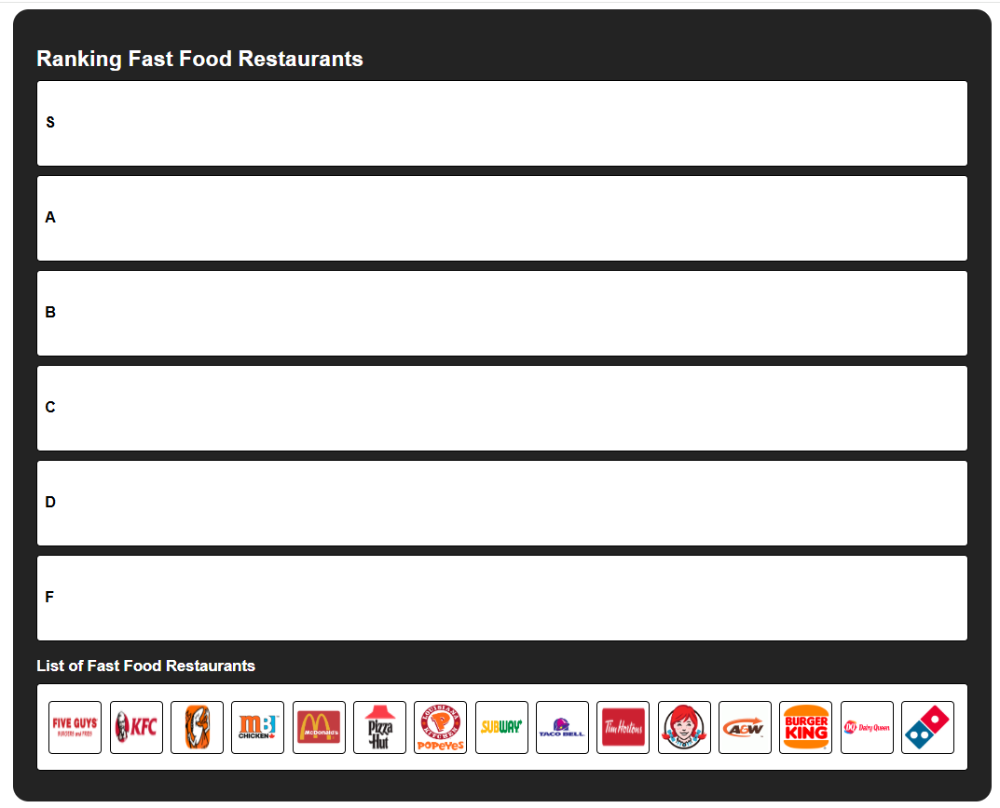
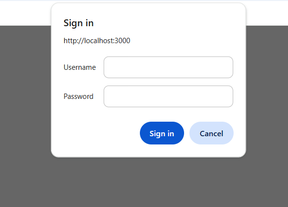
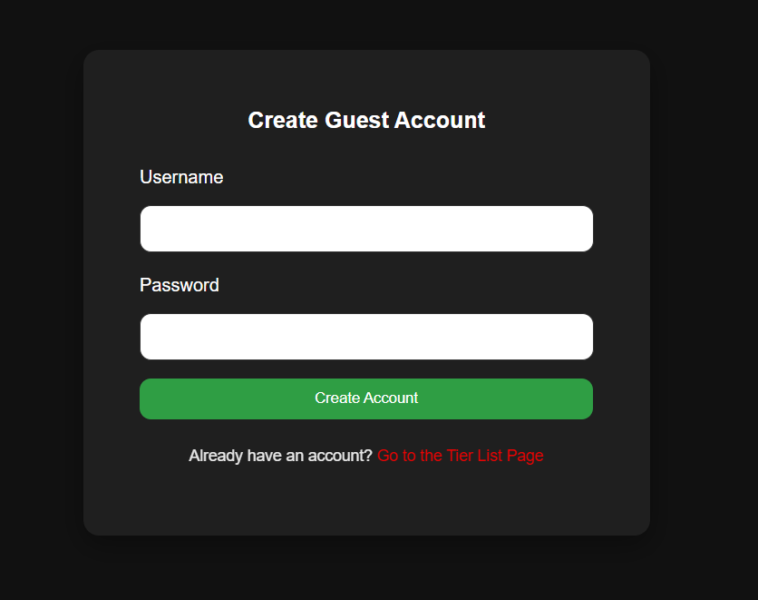
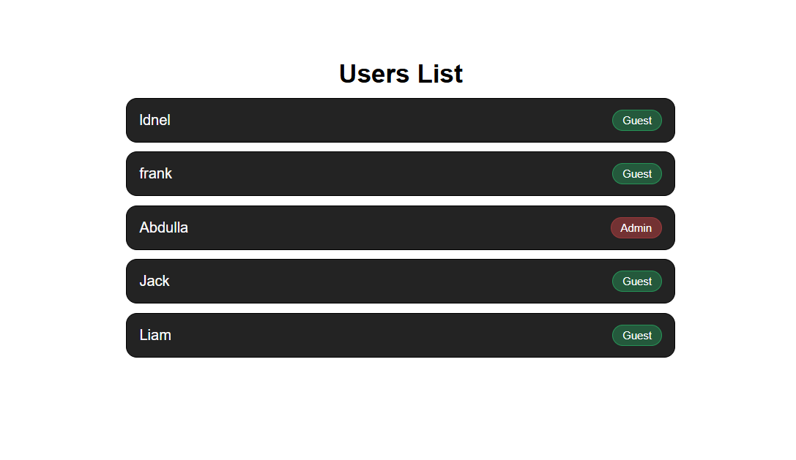

# 🍔 Fast Food Tier List

An interactive tier-list web app built with **Node.js, Express, SQLite, and Handlebars**. Users **log in** and **drag-and-drop** fast-food logos into **S–F tiers**, with rankings saved to SQLite. Includes a lightweight **admin view** for user management. Originally a **COMP 2406** term project, later extended with a **public registration page (/register), mobile-friendly drag-and-drop (Pointer Events)**, and **Render** deployment.

---

## 🌐 Live Demo
- 👉 **Tier List(Register page + Main app):** [View Website Live](https://fast-food-tier-list-project.onrender.com/register)
- 👉 **Users(Admin View):** [View Website Live](https://fast-food-tier-list-project.onrender.com/users)

---

## 🚀 Features
- 🔑 **User Authentication** – Sign up, log in, and manage your tier list.  
- 🏆 **Drag-and-Drop Ranking** – Arrange restaurants into S–F tiers with smooth drag and drop.  
- 🖼️ **Logo Assets** – Restaurant logos are **local images** served by the app (easy to add/update).  
- 💾 **Persistent Data** – Rankings are stored in **SQLite**.  
- ⚙️ **Admin View** – Review registered users and stored lists.  
- 📱 **Responsive Design** – Works on desktop, tablet, and mobile.

---

## 🛠️ Tech Stack
- **Backend:** Node.js, Express
- **Frontend:** HTML, CSS, JavaScript 
- **Templating:** Handlebars (HBS)  
- **Database:** SQLite  
- **Deployment:** Render

---

## 📸 Screenshots

| Tier List Page | Login Page | Register Page | Users Page (For Admin) |
|---|---|---|---|
|  |  |  |  |

---

## ⚙️ Installation & Setup

To run this project locally, follow these steps:

```bash
# 1. Clone the repository
git clone https://github.com/abdullaabdulla97/fast-food-tier-list-project.git
cd fast-food-tier-list-project

# 2. Install dependencies
npm install

# 3. Start SQLite in the project folder (create fastfood.db if it does not exist)
sqlite3 fastfood.db

# 4. Start the server
node server.js

# 5. Local URLs
 - Tier List Register Page: http://localhost:3000/register
 - Tier List Main Page: http://localhost:3000/ranklist
 - Users Page: http://localhost:3000/users

# 6. Test Accounts
- Admin
    - Username: Abdulla
    - Password: Abdulla
- Guest
    - Username: Jack
    - Password: secret
```
---

## 📬 Contact
-  LinkedIn: [LinkedIn](https://www.linkedin.com/in/abdulla-abdulla-350a0937b/)  
- 📧 Email: abdulla.abdulla.salem97@gmail.com  
-  GitHub: [GitHub](https://github.com/abdullaabdulla97)

---
